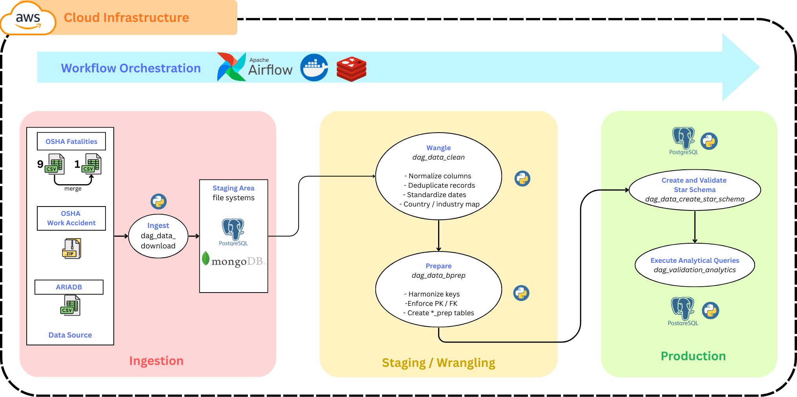
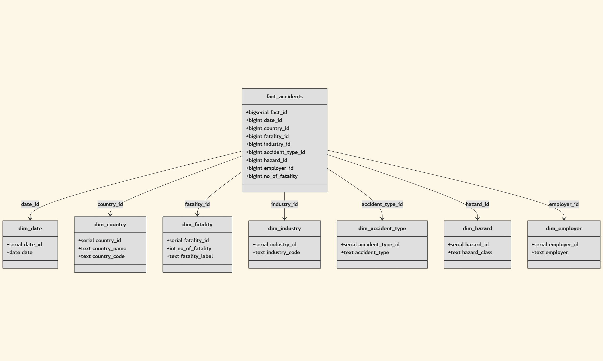

# Workplace incidents analysis: Use case of EU and US


Project [DATA Engineering](https://www.riccardotommasini.com/courses/dataeng-insa-ot/) is provided by [INSA Lyon](https://www.insa-lyon.fr/).

Students:

-   Loe Louis-Marie (louis-marie.loe@insa-lyon.fr)
-   Lancelot Tariot Camille (lancelot.tariot-camille@insa-lyon.fr)
-   Nguyen Sang (sang.nguyen@insa-lyon.fr)

## Table of contents

-   [Introduction](#introduction)
-   [Data sources](#data-sources)
-   [Pipeline](#pipeline)
    -   [Ingestion](#ingestion)
    -   [Staging](#staging)
        -   [Cleansing](#cleansing)
        -   [Transformations](#transformations)
        -   [Enrichments](#enrichments)
    -   [Production](#production)
        -   [Star schema](#star-schema)
        -   [Queries](#queries)
-   [Environment](#environment)
-   [How to run the project](#how-to-run-the-project)
    -   [Local (Docker)](#local-docker)
    -   [AWS (Remote)](#aws-remote)
    -   [AWS Setup](#aws-setup)
-   [Validation and monitoring](#validation-and-monitoring)
-   [Future developments](#future-developments)
-   [Project submission checklist](#project-submission-checklist)
-   [License](#license)

## Introduction

This project implements an end-to-end, containerized data pipeline that ingests public occupational accident datasets (ARIA and OSHA), cleans and standardizes them, and builds a PostgreSQL star schema for reproducible analytics. The report you are reading is the full project report, including the pipeline design, run instructions, and analysis queries.

## Data sources

-   **ARIADB (France)**: [Accidents industriels et technologiques (ARIA)](https://www.data.gouv.fr/api/1/datasets/r/e4a3ad9a-cc9d-40c6-8d1a-aebdf75ded7b)
-   **OSHA Work Accident Case Files (USA)**: [January 2015 to March 2025 accident case files](https://www.osha.gov/sites/default/files/January2015toMarch2025.zip)
-   **OSHA Fatality Summaries (USA)**: nine CSVs published by OSHA for fiscal years 2009-2017 (`CSV_URLS_FATALITIES` in `dags/etl_utils.py`)

## Pipeline



The Airflow orchestration chain is:

1. `dag_data_download` (download raw datasets to `/opt/airflow/data`)
2. `dag_data_clean` (cleaning + standardized tables)
3. `dag_data_bprep` (prep tables ready for star schema)
4. `dag_data_bcreate_star_schema` (dimensions, fact table, tests)
5. `dag_data_analytics_validation` (automated validation queries)

### Ingestion

-   ARIADB is downloaded via a MongoDB staging step to enforce schema-safe ingestion before exporting to CSV and loading to Postgres.
-   OSHA work accidents are downloaded as a ZIP file and extracted to a single CSV.
-   OSHA fatalities are downloaded as nine CSV files with retries and local fallback.

### Staging

#### Cleansing

-   Column names are normalized (lowercase snake_case, accents removed).
-   Dates are standardized to ISO format.
-   Duplicates are removed on primary identifiers (e.g., `aria_id`, `upa`).
-   Countries are normalized (e.g., USA/US/United States -> `USA`).

#### Transformations

-   Raw tables are filtered to the required columns for analytics.
-   Clean tables are reshaped into `*_prep` tables to align with star schema keys.
-   Types are enforced for numeric identifiers and metrics.

#### Enrichments

-   Country codes are derived for `dim_country`.
-   Employer names and hazard classes are standardized before dimension loading.

### Production

The production phase builds a star schema in `data_db` and runs validation queries.

#### Star schema



-   Dimensions: `dim_date`, `dim_country`, `dim_industry`, `dim_accident_type`, `dim_hazard`, `dim_employer`, `dim_fatality`
-   Fact table: `fact_accidents` (one record per standardized accident)

#### Queries

The following 5 queries are executed by `dag_data_analytics_validation` and saved to `./data/analytics_results` once the star schema build completes.

1. Fatalities by year (descending by year)

```sql
SELECT
    EXTRACT(YEAR FROM d.date) AS year,
    SUM(f.no_of_fatality) AS total_fatalities
FROM fact_accidents f
JOIN dim_date d ON f.date_id = d.date_id
GROUP BY EXTRACT(YEAR FROM d.date)
ORDER BY year DESC
```

2. Fatalities by country (all time)

```sql
SELECT
    c.country_name AS country,
    SUM(f.no_of_fatality) AS total_fatalities
FROM fact_accidents f
JOIN dim_country c ON f.country_id = c.country_id
GROUP BY c.country_name
ORDER BY total_fatalities DESC
```

3. France vs USA (last 10 years)

```sql
SELECT
    EXTRACT(YEAR FROM d.date) AS year,
    SUM(CASE WHEN c.country_name = 'FRANCE' THEN f.no_of_fatality ELSE 0 END) AS france,
    SUM(CASE WHEN c.country_name = 'USA' THEN f.no_of_fatality ELSE 0 END) AS usa
FROM fact_accidents f
JOIN dim_country c ON f.country_id = c.country_id
JOIN dim_date d ON f.date_id = d.date_id
WHERE d.date >= (CURRENT_DATE - INTERVAL '10 years')
GROUP BY EXTRACT(YEAR FROM d.date)
ORDER BY year DESC
```

4. Top 10 countries by fatalities (all time)

```sql
SELECT
    c.country_name AS country,
    SUM(f.no_of_fatality) AS total_fatalities
FROM fact_accidents f
JOIN dim_country c ON f.country_id = c.country_id
GROUP BY c.country_name
ORDER BY total_fatalities DESC
LIMIT 10
```

5. Recent 10-year fatalities by country

```sql
SELECT
    c.country_name AS country,
    SUM(f.no_of_fatality) AS total_fatalities
FROM fact_accidents f
JOIN dim_country c ON f.country_id = c.country_id
JOIN dim_date d ON f.date_id = d.date_id
WHERE d.date >= (CURRENT_DATE - INTERVAL '10 years')
GROUP BY c.country_name
ORDER BY total_fatalities DESC
```

## Environment

### Stack

-   Apache Airflow 3.1 (Celery Executor + Redis)
-   PostgreSQL 16 (`data_db` for project tables)
-   MongoDB 7 (ARIADB staging)

Tool versions (from `Dockerfile`, `docker-compose.yml`, and `requirements.txt`):

-   Airflow image: `apache/airflow:3.1.0`
-   PostgreSQL: `postgres:16`
-   Redis: `redis:7.2-bookworm`
-   MongoDB: `mongo:7`
-   Mongo Express: `mongo-express:latest` (tag not pinned)
-   pgAdmin: `elestio/pgadmin` (tag not pinned)
-   Python packages: `apache-airflow==3.1.0`, `pandas==2.2.2`, `pymongo==4.10.1`, `psycopg2-binary==2.9.9`

### Services

| Service          | URL                   | Default credentials        | Notes                                                                     |
| ---------------- | --------------------- | -------------------------- | ------------------------------------------------------------------------- |
| Airflow UI / API | http://localhost:8080 | `airflow` / `airflow`      | Unpause and trigger DAGs, inspect task logs, clear runs.                  |
| pgAdmin          | http://localhost:5050 | `admin@admin.com` / `root` | Use for database browsing. Default connection is available under Servers. |
| Mongo Express    | http://localhost:8085 | `admin` / `admin`          | Inspect the temporary ARIADB collection after download.                   |
| Redis            | n/a                   | n/a                        | Used internally by Airflow Celery, no UI exposed.                         |

PgAdmin connection details (if you create a new server):

-   Hostname: `postgres`
-   Maintenance database: `postgres`
-   Username: `data_user`
-   Password: `root`

Databases in Postgres:

-   `airflow` for Airflow metadata only
-   `postgres` as the maintenance database
-   `data_db` for all project tables

Python dependencies are installed from `requirements.txt`. It includes only the runtime dependencies required by the ETL (Airflow, pandas, pymongo, psycopg2-binary).

## How to run the project

Follow the steps below to run the pipeline end-to-end.

### Local (Docker)

1. Clone the [repository](https://github.com/vieuxcolon/lancelot-sang-louis-dataeng) and `cd` into the project root.
2. Open `.env` and update any default credentials you want to change, for example Airflow (`_AIRFLOW_WWW_USER_USERNAME`, `_AIRFLOW_WWW_USER_PASSWORD`), pgAdmin (`PGADMIN_DEFAULT_EMAIL`, `PGADMIN_DEFAULT_PASSWORD`), Mongo Express (`ME_CONFIG_BASICAUTH_USERNAME`, `ME_CONFIG_BASICAUTH_PASSWORD`), and the data DB user (`DATA_POSTGRES_USER`, `DATA_POSTGRES_PASSWORD`).
3. From the project root, start the stack: `docker compose up -d` (add `--build` on the first run or after dependency changes).
4. (Optional) Confirm containers are running: `docker compose ps`.
5. Open Airflow at http://localhost:8080 and sign in with the Airflow credentials from `.env` (defaults `airflow` / `airflow`).
6. In the left sidebar, click `DAGs`.
7. Toggle each DAG to "on" (unpause).
8. Click `dag_data_download`, then click "Trigger DAG" (play button). Do not manually trigger downstream DAGs; they will chain automatically.
9. Wait for the run chain to finish successfully (last DAG: `dag_data_analytics_validation`).
10. Open pgAdmin at http://localhost:5050 and sign in with `PGADMIN_DEFAULT_EMAIL` / `PGADMIN_DEFAULT_PASSWORD`.
11. Run the analytical queries (see the Queries section above).

Notes:

-   The ETL rebuilds tables each run. Results are deterministic for a fixed snapshot of source data, but live sources and time-relative queries can change outputs over time.
-   Do not run analytical queries while DAGs are running. Run queries either before launching a new run or after all DAGs finish successfully.

### AWS (Remote)

On AWS, the project can be accessed using the EC2 public IP and service ports.
For example, if your EC2 instance has public IP 54.74.220.227, the connection URLs are as follows:

1. Access Airflow UI: http://54.74.220.227:8080
2. Access Mongo Express: http://54.74.220.227:8085
3. Access pgAdmin: http://54.74.220.227:5050

From the Airflow UI, activate all DAGs and launch `dag_data_download`. This DAG will trigger the entire DAG chain. The entire DAG chain is as follows:
`dag_data_download -> dag_data_clean -> dag_data_bprep -> dag_data_bcreate_star_schema -> dag_data_analytics_validation`

### AWS Setup

To set up the project on AWS, launch an Ubuntu 22.04 LTS t3.large instance. Use your keypair to copy the Bash script `setup_ec2_etl.sh` to the EC2 instance. Use Bash to launch the project setup.
e.g., given an EC2 instance with IP address 54.74.220.227, here is an example of project setup steps.

1. Authorize traffic to the Security Group to which the EC2 instance belongs (here `$SG_ID`) for ports `22`, `8080`, `5050`, and `8081`. This allows traffic from all hosts to the specified ports.
    ```powershell
    aws ec2 authorize-security-group-ingress --group-id $SG_ID --protocol tcp --port 22 --cidr 0.0.0.0/0
    aws ec2 authorize-security-group-ingress --group-id $SG_ID --protocol tcp --port 8080 --cidr 0.0.0.0/0
    aws ec2 authorize-security-group-ingress --group-id $SG_ID --protocol tcp --port 5050 --cidr 0.0.0.0/0
    aws ec2 authorize-security-group-ingress --group-id $SG_ID --protocol tcp --port 8081 --cidr 0.0.0.0/0
    ```
2. Copy the `setup_ec2_etl.sh` file to the EC2 instance:
    ```bash
    scp -i ~/.ssh/etl-keypair.pem setup_ec2_etl.sh ubuntu@54.74.220.227:~
    ```
3. Log in to the AWS EC2 instance using a VS Code terminal or another terminal with your EC2 keypair:
    ```bash
    ssh -i ~/.ssh/etl-keypair.pem ubuntu@54.74.220.227
    ```
4. Launch the project setup with bash and wait until the setup finishes:
    ```
    chmod +x setup_ec2_etl.sh; bash setup_ec2_etl.sh
    ```
5. Connect to the project via a browser using the correct URL: e.g.:

    `http://54.74.220.227:8080 (Apache Airflow)`

    `http://54.74.220.227:8085 (Mongo Express)`

    `http://54.74.220.227:5050 (pgAdmin)`

Note: Even though a smaller EC2 instance could work successfully with our project, we tested it solely on an Ubuntu 22.04 LTS t3.large instance.

## Validation and monitoring

-   `dag_data_bcreate_star_schema` runs `min_test_star_schema` and `full_test_star_schema` before analytics.
-   `dag_data_analytics_validation` runs the analytics queries and store the results under ./data/analytics_results
-   Airflow logs are mounted under `./logs`; raw and analytics outputs are in `./data`.

## Future developments

-   Provide offline sample datasets to allow full testing without network access.
-   Extend the star schema with additional dimensions (e.g., region or employer sector).
-   Integrate Druid into the project architecture

## Project submission checklist

-   [x] Repository with the code, well documented
-   [x] Docker-compose file to run the environment
-   [x] Detailed description of the various steps
-   [x] Report in the README with project design steps divided per area
-   [x] Example dataset for offline testing
-   [x] Slides for the project poster (add `poster.md` or `slides.md`)
-   [x] Airflow + pandas + MongoDB + Postgres used in the pipeline
-   [x] Star schema built in Postgres

## License

This project is released under the [CC0 1.0 Universal](LICENSE) license.
